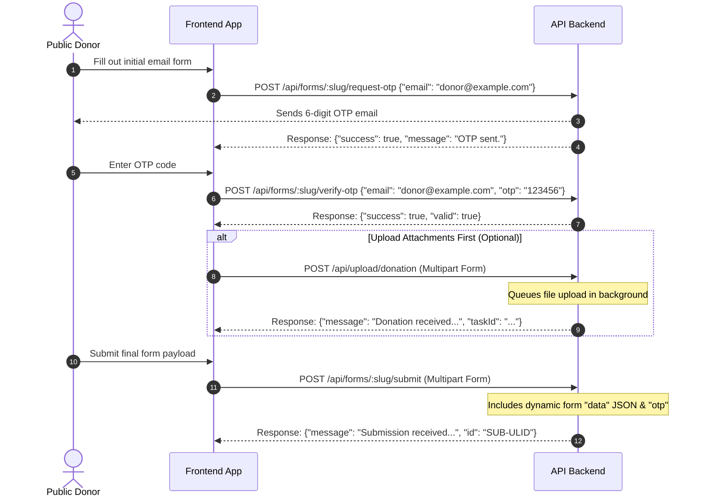
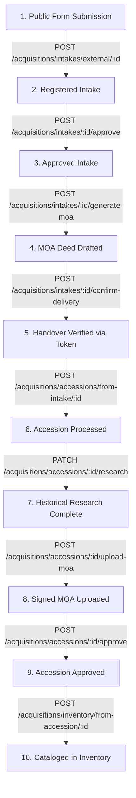

# Museo Bulawan CMS - API Routing & Call arrangement Map

This document serves as the architectural reference for frontend developers integrating with the Museo Bulawan CMS backend API. It maps out all endpoints, payloads, response formats, and sequential request arrangements for both the **Public (Visitor/Donor)** and **Admin (Staff/Curator/Registrar)** portals.

---

## 1. Sequential Call Arrangements & Workflows

### 1.1. Public Portal: Submission Flow (Visitor/Donor)
When a public donor or visitor submits a donation proposal or object form, the frontend must follow this exact sequential handshake.

1. **Step 1: Request OTP**
   - **Endpoint**: `POST /api/forms/:slug/request-otp`
   - **Payload**: `{"email": "donor@example.com"}`
2. **Step 2: Verify OTP**
   - **Endpoint**: `POST /api/forms/:slug/verify-otp`
   - **Payload**: `{"email": "donor@example.com", "otp": "123456"}`
3. **Step 3 (Optional): Upload Pre-attachments**
   - **Endpoint**: `POST /api/upload/donation`
   - **Payload**: Form-Data with key `file` (single) and `formId` (e.g. `donation-form`).
4. **Step 4: Finalize Submission**
   - **Endpoint**: `POST /api/forms/:slug/submit`
   - **Payload**: Form-Data containing:
     - `data`: stringified JSON containing dynamic fields matching the form definition (e.g. `{"donorName": "Jane Doe", "itemName": "Antique Gold Coin"}`)
     - `otp`: verified OTP token
     - `attachments`: File list (max 5 files, max 15MB total).

---

### 1.2. Admin Portal: Core Acquisition Lifecycle
The acquisition lifecycle is a strict sequential chain processing an item from a submission into the official museum catalog.

#### Step-by-Step API Sequence:
1. **Process External Intake**:
   - **Endpoint**: `POST /api/acquisitions/intakes/external/:submissionId`
   - **Result**: Creates an intake item with state `pending_approval`.
2. **Approve Intake**:
   - **Endpoint**: `POST /api/acquisitions/intakes/:intakeId/approve`
   - **Result**: Transition status to `approved`.
3. **Generate MOA**:
   - **Endpoint**: `POST /api/acquisitions/intakes/:intakeId/generate-moa`
   - **Payload**: `{"donorName": "Optional Overridden Name"}`
   - **Result**: Generates a Deed of Gift/MOA draft and registers a physical handover verification token.
4. **Handover & Delivery Verification**:
   - **Endpoint**: `POST /api/acquisitions/intakes/:intakeId/confirm-delivery`
   - **Payload**: `{"token": "48BFA659"}` (Verification token presented by donor)
   - **Result**: Transitions intake state to `delivered` (Artifact in custody).
5. **Begin Accession Processing**:
   - **Endpoint**: `POST /api/acquisitions/accessions/from-intake/:intakeId`
   - **Payload**: `{"accessionNumber": "ACC-2026-001", "conditionReport": "Good", "handlingInstructions": "Fragile"}`
   - **Result**: Creates accession record in `pending_approval` state.
6. **Log Research Findings**:
   - **Endpoint**: `PATCH /api/acquisitions/accessions/:accessionId/research`
   - **Payload**: `{"materials": "Gold", "dimensions": "10cm x 10cm", "historical_significance": "19th century coins", "research_completed": true}`
7. **Attach Signed Legal Deeds**:
   - **Endpoint**: `POST /api/acquisitions/accessions/:accessionId/upload-moa`
   - **Payload**: Multipart form-data containing PDF scan of signed agreement.
8. **Approve Accession**:
   - **Endpoint**: `POST /api/acquisitions/accessions/:accessionId/approve`
   - **Payload**: `{"notes": "Verified signatures and physical condition."}`
   - **Result**: Accession enters `in_research` -> `finalized` (transitional ready for cataloging).
9. **Finalize to Catalog (Inventory)**:
   - **Endpoint**: `POST /api/acquisitions/inventory/from-accession/:accessionId`
   - **Payload**: `{"catalogNumber": "CAT-4819", "location": "Main Vault", "conditionReport": "Excellent"}`
   - **Result**: Cataloged artifact created in the permanent collection.

---

### 1.3. Admin Portal: Inventory Subsystems & Movements
Once cataloged, artifacts can undergo location transfers, valuations, outbound loans, and conservation treatments.

#### Location Transfer Flow:
* **Single Transfer**: `POST /api/acquisitions/inventory/:inventoryId/transfer`
  - Payload: `{"toLocation": "Conservation Lab", "reason": "Restoration work"}`
* **Batch Transfer**: `POST /api/acquisitions/inventory/batch-transfer`
  - Payload: `{"inventoryIds": ["INV-01", "INV-02"], "toLocation": "Exhibition Room A", "reason": "New show"}`

#### Valuation Tracking:
* **Log Valuation (SPECTRUM)**: `POST /api/acquisitions/inventory/:inventoryId/valuations`
  - Payload: `{"amount": 55000.00, "currency": "PHP", "date": "2026-05-23", "reason": "Insurance update", "valuer": "John Valuer"}`

#### Outbound Loan Lifecycle:
1. **Draft Outbound Loan**: `POST /api/acquisitions/loans`
   - Payload: `{"loan_type": "outbound", "venue": "Metropolitan Museum", "start_date": "2026-06-01", "end_date": "2026-12-01", "artifacts": ["INV-01"]}`
2. **Activate Loan**: `POST /api/acquisitions/loans/:loanId/activate`
   - Result: Moves loan status to `active`; automatically transition artifacts status to `loan`.
3. **Return Loan**: `POST /api/acquisitions/loans/:loanId/return`
   - Payload: `{"reason": "Returned in perfect condition"}`
   - Result: Moves loan status to `returned`; automatically auto-derives and updates artifact status back to `storage` or `active` based on its location and latest condition report.

---

## 2. API Endpoints Directory

### 2.1. Authentication Routes (`/auth`)
| HTTP Method | URL | Auth | Payload Description | Response Sample |
|---|---|---|---|---|
| `POST` | `/api/auth/login` | Public | Credentials: `{"username": "admin", "password": "password"}` | `{"message": "Logged in successfully", "user": {...}}` |
| `POST` | `/api/auth/logout` | Session | None | `{"message": "Logged out successfully"}` |
| `GET` | `/api/auth/check` | Session | None (Cookie check) | `{"valid": true, "user": {...}}` |

### 2.2. User Management Routes (`/user`)
| HTTP Method | URL | Role Required | Payload Description | Response Sample |
|---|---|---|---|---|
| `POST` | `/api/user/onboard-admin` | Public | First admin creation: `{"fname", "lname", "email", "password"}` | `{"success": true, "message": "Admin onboarded"}` |
| `POST` | `/api/user/complete-setup` | Public | Setup invited account: `{"token", "password"}` | `{"success": true, "message": "Setup completed"}` |
| `POST` | `/api/user/request-reset` | Public | Forgot password: `{"email"}` | `{"message": "Reset email sent"}` |
| `POST` | `/api/user/reset-password` | Public | New password: `{"token", "newPassword"}` | `{"message": "Password reset successfully"}` |
| `GET` | `/api/user/me` | Authenticated | None | Profile object + user details |
| `PATCH` | `/api/user/me` | Authenticated | `{"fname", "lname"}` | `{"message": "Profile updated", "user": {...}}` |
| `POST` | `/api/user/me/change-password` | Authenticated | `{"currentPassword", "newPassword"}` | `{"message": "Password changed successfully"}` |
| `GET` | `/api/user/` | `read` User | Search/filter params | `{"status": "success", "data": [...]}` |
| `POST` | `/api/user/invite` | `create` User | `{"fname", "lname", "email", "role"}` | `{"message": "User invited", "inviteUrl": "..."}` |
| `POST` | `/api/user/:id/resend-invite` | `update` User | None | `{"message": "Invitation email resent"}` |
| `PATCH` | `/api/user/:id` | `update` User | Profile / Role modification fields | `{"message": "User updated"}` |
| `POST` | `/api/user/:id/deactivate` | `delete` User | None | `{"message": "User deactivated"}` |
| `POST` | `/api/user/:id/force-logout` | `manage` all | None | `{"message": "Force logout triggered"}` |

### 2.3. Form Routes (`/forms`)
| HTTP Method | URL | Auth | Payload Description | Response Sample |
|---|---|---|---|---|
| `GET` | `/api/forms/:slug` | Public | None | Form schema definition (for rendering inputs) |
| `POST` | `/api/forms/:slug/request-otp` | Public | `{"email": "donor@example.com"}` | `{"success": true, "message": "OTP sent"}` |
| `POST` | `/api/forms/:slug/verify-otp` | Public | `{"email": "donor@example.com", "otp": "123456"}` | `{"success": true, "valid": true}` |
| `POST` | `/api/forms/:slug/submit` | Public | Form-data: `data` (JSON), `otp` (String), `attachments` (File[]) | `{"message": "Submission received", "id": "ULID"}` |
| `GET` | `/api/forms/admin/submissions` | `read` Intake | Pagination/Filter params | List of all guest submissions |
| `GET` | `/api/forms/admin/submissions/:id` | `read` Intake | None | Detailed single submission payload |
| `GET` | `/api/forms/:slug/submissions` | `read` Intake | Pagination params | List of submissions under specific form |

### 2.4. Acquisition Routes (`/acquisitions`)
| HTTP Method | URL | CASL Capability | Payload | Response / Impact |
|---|---|---|---|---|
| `GET` | `/api/acquisitions/intakes` | Authenticated | Pagination/Query | List of registered intakes |
| `POST` | `/api/acquisitions/intakes/internal` | `create` Intake | `{"itemName", "sourceInfo", "method", "loanEndDate"}` | Registers direct internal/purchase intake |
| `POST` | `/api/acquisitions/intakes/:id/approve` | `update` Intake | None | Moves intake to `approved` status |
| `POST` | `/api/acquisitions/intakes/:id/reject` | `update` Intake | `{"reason"}` | Rejects intake proposal |
| `POST` | `/api/acquisitions/intakes/:id/generate-moa` | `update` Intake | `{"donorName", "loanDuration"}` | Generates MOA & Handover OTP |
| `POST` | `/api/acquisitions/intakes/:id/confirm-delivery`| Authenticated | `{"token"}` | Confirms hand-delivered item (OTP verification) |
| `POST` | `/api/acquisitions/accessions/from-intake/:id`| `create` Accession | `{"accessionNumber", "conditionReport", "handlingInstructions"}` | Initiates accession record creation |
| `PATCH` | `/api/acquisitions/accessions/:id/research` | `update` Accession | `{"dimensions", "materials", "research_notes", ...}` | Stores object historical research findings |
| `POST` | `/api/acquisitions/accessions/:id/upload-moa` | `update` Accession | Form-data: `files` (PDFs) | Binds scanned signatures to the accession file |
| `POST` | `/api/acquisitions/accessions/:id/approve` | `update` Accession | `{"notes"}` | Approves accession and authorizes final cataloging |
| `POST` | `/api/acquisitions/inventory/from-accession/:id`| `create` Inventory | `{"catalogNumber", "location", "conditionReport"}` | Transitions artifact to official permanent catalog |
| `POST` | `/api/acquisitions/inventory/:id/transfer` | `update` Inventory | `{"toLocation", "reason"}` | Triggers location update and recalculates status |
| `POST` | `/api/acquisitions/inventory/batch-transfer` | `update` Inventory | `{"inventoryIds": [], "toLocation", "reason"}` | Executes multi-artifact transfers |
| `POST` | `/api/acquisitions/inventory/:id/deaccession` | `delete` Inventory | `{"reason"}` | Proposes artifact disposal (status: `deaccession_pending`) |
| `POST` | `/api/acquisitions/inventory/:id/approve-deaccession` | `delete` Inventory | None | Finalizes disposal (status: `deaccessioned`) |
| `POST` | `/api/acquisitions/inventory/:id/cancel-deaccession` | `delete` Inventory | None | Cancels disposal and restores active status |
| `POST` | `/api/acquisitions/inventory/:id/audit` | `update` Inventory | `{"auditType", "conditionConsistent", "observedCondition", ...}` | Logs condition audit and recalculates status |

### 2.5. Compliance & Authority Control (SPECTRUM)
| HTTP Method | URL | Auth/Role | Payload | Usage |
|---|---|---|---|---|
| `GET` | `/api/acquisitions/constituents` | Authenticated | Pagination | Fetches authorities (artists, donors, institutions) |
| `POST` | `/api/acquisitions/constituents` | Authenticated | `{"fname", "lname", "type", ...}` | Adds new constituent |
| `GET` | `/api/acquisitions/locations` | Authenticated | None | Retrieve physical and virtual locations list |
| `POST` | `/api/acquisitions/locations` | `update` Inventory | `{"name", "type", "description"}` | Creates new storage room, gallery, or display case |
| `GET` | `/api/acquisitions/inventory/:id/valuations`| Authenticated | None | Retrieve monetary evaluation history |
| `POST` | `/api/acquisitions/inventory/:id/valuations`| `update` Inventory | `{"amount", "currency", "date", "reason"}` | Logs updated item valuation |
| `GET` | `/api/acquisitions/exhibitions` | Authenticated | Query params | List active/planned exhibitions |
| `POST` | `/api/acquisitions/exhibitions` | `create` Exhibition| `{"title", "venue", "startDate", "endDate"}` | Creates an exhibition |
| `POST` | `/api/acquisitions/exhibitions/:id/artifacts`| `update` Exhibition| `{"inventoryId", "displayNotes"}` | Assigns cataloged item to exhibition |

---

## 3. Real-Time Streaming & Notifications

### 3.1. SSE Endpoint (`/realtime/stream`)
Admin portal client apps should establish a persistent Server-Sent Events (SSE) connection upon user login.
* **Stream URL**: `GET /api/realtime/stream` (Cookie-authenticated)
* **Automatically Subscribed Channels**:
  - `global` - Broad notification events.
  - `role_[admin|registrar|conservator|etc]` - Role-specific task alerts.
  - `user_[userId]` - User-specific alerts (e.g. session eviction).
  - `inventory` / `accessions` / `intakes` / `form_submissions` - DB change notifications pushed to clients holding the corresponding CASL read permissions.

#### Key SSE Push Event Types:
1. `db_change`: Notifies that a table's records have been added or updated. Allows the client to refresh cache/lists reactively.
2. `notification`: Standard workspace push alert.
3. `force_logout`: Triggers immediate client-side session destruction (e.g. concurrent logins).

---

## 4. Media & Direct File Attachments

### 4.1. Media Junctions (`/media`)
Handles uploading photographs, condition sketches, and signed files associated with intakes, accessions, and inventory items.
* **Upload via Parameters**: `POST /api/media/:entityType/:entityId`
  - Multipart: `files` (max 10 attachments, up to 20MB per file), `caption` (text)
* **Upload via Body**: `POST /api/media/upload`
  - Multipart: `files` (max 10), `entity_type` (`inventory`|`accession`|`intake`), `entity_id` (ULID), `caption` (text)
* **List Attachments**: `GET /api/media/:entityType/:entityId`
* **Delete Attachment**: `DELETE /api/media/:mediaId`

### 4.2. Direct Upload & Streaming
* **Temporary Upload**: `POST /api/upload/artifact` (Authenticating staff only; queues file processing).
* **Private Documents Fetching**: `GET /api/files/:collection/:recordId/:filename`
  - Retains authorization protection on sensitive documents like Deeds of Gift (MOAs), loan agreements, and valuation sheets.
