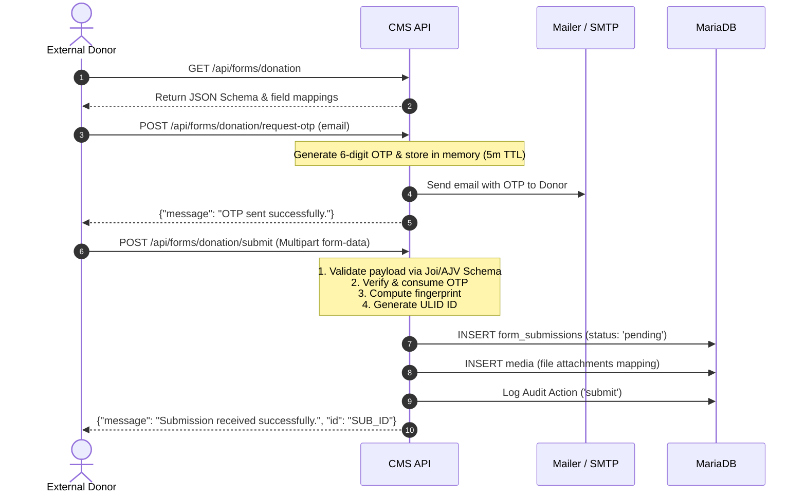

# API Routing Guide: Forms Service & Donation Form Lifecycle

This document provides a comprehensive routing guide and technical reference for interacting with the **Forms Service** and processing a **Donation Form Submission** in the Museo Bulawan CMS.

---

## 1. Directory Structure and Architectural Roles

Key files managing form definitions, routing, and post-submission automation:
- **Routing**:
  - [routes/index.js](file:///C:/Users/jeffe/Development/prod-dev/museo-bulawan-cms/apps/api/src/routes/index.js) — Root router mounting `/forms` and `/acquisitions`.
  - [routes/form/index.js](file:///C:/Users/jeffe/Development/prod-dev/museo-bulawan-cms/apps/api/src/routes/form/index.js) — Direct routes for form submission, OTP lifecycle, and admin-facing submission views.
  - [routes/acquisition/index.js](file:///C:/Users/jeffe/Development/prod-dev/museo-bulawan-cms/apps/api/src/routes/acquisition/index.js) — Routes for staff-facing actions, including processing, rejecting, and reopening submissions.
- **Controllers**:
  - [controllers/formController.js](file:///C:/Users/jeffe/Development/prod-dev/museo-bulawan-cms/apps/api/src/controllers/formController.js) — Unified controller facade.
  - [controllers/form/submissionController.js](file:///C:/Users/jeffe/Development/prod-dev/museo-bulawan-cms/apps/api/src/controllers/form/submissionController.js) — Public submission actions.
  - [controllers/form/queryController.js](file:///C:/Users/jeffe/Development/prod-dev/museo-bulawan-cms/apps/api/src/controllers/form/queryController.js) — Staff query actions.
  - [controllers/acquisition/intakeController.js](file:///C:/Users/jeffe/Development/prod-dev/museo-bulawan-cms/apps/api/src/controllers/acquisition/intakeController.js) — Staff intake operations.
- **Services**:
  - [services/formService.js](file:///C:/Users/jeffe/Development/prod-dev/museo-bulawan-cms/apps/api/src/services/formService.js) — Service facade.
  - [services/form/submissionService.js](file:///C:/Users/jeffe/Development/prod-dev/museo-bulawan-cms/apps/api/src/services/form/submissionService.js) — Form parsing, fingerprinting, and saving.
  - [services/form/verificationService.js](file:///C:/Users/jeffe/Development/prod-dev/museo-bulawan-cms/apps/api/src/services/form/verificationService.js) — Email OTP generation and verification.
  - [services/formPipelineService.js](file:///C:/Users/jeffe/Development/prod-dev/museo-bulawan-cms/apps/api/src/services/formPipelineService.js) — Orchestrates workflow transitions between forms and core models.
  - [services/form/pipeline/donationPipeline.js](file:///C:/Users/jeffe/Development/prod-dev/museo-bulawan-cms/apps/api/src/services/form/pipeline/donationPipeline.js) — Concrete processing logic for converting a donation submission into intake and donor profiles.

---

## 2. API Routing Reference

### A. Public Forms Endpoints

These endpoints are exposed to the public visitor site to fetch form requirements, verify donor identity via OTP, and submit donation details.

| Method | Endpoint | Description | Rate Limiting |
|:---|:---|:---|:---|
| **GET** | `/api/forms/:slug` | Retrieves the form JSON schema and mapped configuration | - |
| **POST** | `/api/forms/:slug/request-otp` | Generates and sends a 6-digit OTP code to the provided email | `strictActionLimiter` |
| **POST** | `/api/forms/:slug/verify-otp` | Validates a code prior to form submission | `strictActionLimiter` |
| **POST** | `/api/forms/:slug/submit` | Submits the form data and uploads optional files | `publicFormLimiter` |

---

### B. Staff Administration Endpoints

These endpoints are used by authorized museum personnel (Admins/Curators) to query, reject, restore, or process submissions.

| Method | Endpoint | Description | Auth & Permission Required |
|:---|:---|:---|:---|
| **GET** | `/api/forms/admin/submissions` | Lists all form submissions | Token + `read Intake` |
| **GET** | `/api/forms/:slug/submissions` | Lists submissions filtered by form slug | Token + `read Intake` |
| **GET** | `/api/forms/admin/submissions/:submissionId` | Details of a single submission (with attachments) | Token + `read Intake` |
| **POST** | `/api/acquisitions/submissions/:submissionId/reject` | Rejects/archives a submission (`pending` ➔ `archived`) | Token + `update Intake` |
| **POST** | `/api/acquisitions/submissions/:submissionId/reopen` | Reopens a submission (`archived` ➔ `pending`) | Token + `update Intake` |
| **POST** | `/api/acquisitions/intakes/external/:submissionId` | Processes the submission and registers the intake | Token + `create Intake` |

---

## 3. Step-by-Step Donation Submission Guide

Below is the sequence of API interactions performed when a visitor submits a donation.



### Step 1: Request OTP
- **Endpoint**: `POST /api/forms/donation/request-otp`
- **Request Body**:
  ```json
  {
    "email": "donor@example.com"
  }
  ```
- **Response (200 OK)**:
  ```json
  {
    "message": "OTP sent successfully."
  }
  ```
  *(In `development` environments, the OTP is also printed in the API server logs like: `[DEV] OTP for donor@example.com: 123456`)*

### Step 2: Submit Form Data
- **Endpoint**: `POST /api/forms/donation/submit`
- **Content-Type**: `multipart/form-data`
- **Form Fields**:
  - `data` (JSON string, Required): Contains the form field payload conforming to the form schema.
  - `otp` (6-digit string, Required if OTP is configured in the definition): The OTP code received.
  - `attachments` (File(s), Optional): Up to 5 attachments (Max 15MB per file).
- **Example Payload for `data`**:
  ```json
  {
    "donor_first_name": "Juan",
    "donor_last_name": "Dela Cruz",
    "donor_email": "donor@example.com",
    "donor_title": "Mr.",
    "donor_phone": "+639171234567",
    "donor_address": "Manila, Philippines",
    "acquisition_type": "gift",
    "items": [
      {
        "itemName": "Antique Gold Pendant",
        "description": "Pre-colonial gold filigree pendant from Cebu region.",
        "quantity": 1
      }
    ]
  }
  ```
- **Response (201 Created)**:
  ```json
  {
    "message": "Submission received successfully.",
    "id": "01HZZZZZZZZZZZZZZZZZZZZZZZ"
  }
  ```

---

## 4. Processing Submissions into Intakes

When a staff member accepts a pending submission, they trigger the **Donation Pipeline** via:
- **Endpoint**: `POST /api/acquisitions/intakes/external/:submissionId`
- **Headers**: `Authorization: Bearer <token>`
- **Response (200 OK)**:
  ```json
  {
    "message": "External submission processed into 1 intake(s).",
    "intakes": [
      {
        "id": "01HZZZZZZZZZ_INTAKE",
        "submission_id": "01HZZZZZZZZZZZZZZZZZZZZZZZ",
        "donation_item_id": "01HZZZZZZZZZ_DONATION",
        "donor_account_id": "01HZZZZZZZZZ_USER",
        "proposed_item_name": "Antique Gold Pendant",
        "donor_info": "Juan Dela Cruz",
        "acquisition_method": "gift",
        "status": "under_review",
        "moa_status": "pending"
      }
    ],
    "donationItems": [
      {
        "id": "01HZZZZZZZZZ_DONATION",
        "submission_id": "01HZZZZZZZZZZZZZZZZZZZZZZZ",
        "item_name": "Antique Gold Pendant",
        "description": "Pre-colonial gold filigree pendant from Cebu region.",
        "quantity": 1,
        "status": "accepted"
      }
    ]
  }
  ```

---

## 5. Under-the-Hood: The Donation Pipeline Workflow

When `POST /api/acquisitions/intakes/external/:submissionId` is called, the system performs a sequence of operations managed by the [donationPipeline](file:///C:/Users/jeffe/Development/prod-dev/museo-bulawan-cms/apps/api/src/services/form/pipeline/donationPipeline.js):

### Phase 1: Donor Account Provisioning
1. **Mutex Locked Execution**: The process is isolated using `globalMutex.runExclusive('sub_${submissionId}')`.
2. **Account Check**: The system queries the `users` table. If the email doesn't have an account, it provisions a visitor account.
3. **Password Setup Email**:
   - If the user is new: provisions a secure setup link and emails a `"Donation Accepted - Set Up Your Account"` message.
   - If the user has a pre-existing account: sends an update email with a portal tracking link.

### Phase 2: Atomic Intake Generation
Within a single transaction block:
1. **Extract Form Mappings**: Uses the form settings mapping configuration to read donor name, items, descriptions, and quantities.
2. **Create Records**: For each item in the submission:
   - Registers a record in `donation_items` (status: `accepted`).
   - Registers a record in `intakes` (status: `under_review`, `moa_status: pending`).
3. **Update Status**: Updates the parent submission status (`form_submissions.status = 'processed'`).
4. **Notify Staff**: Sends an in-app SSE notification alert to all Admins.
