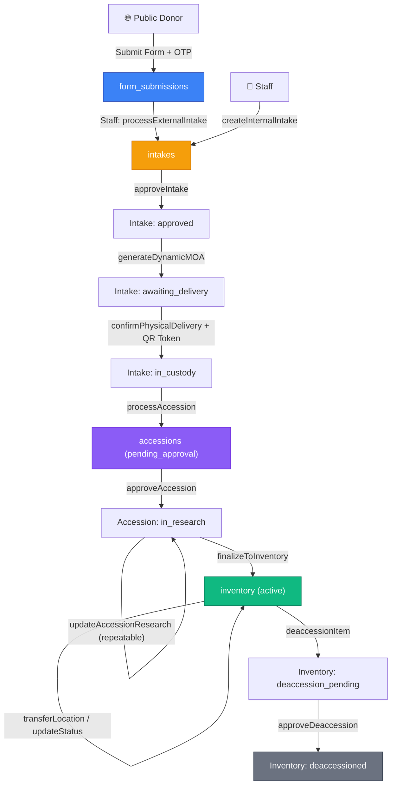
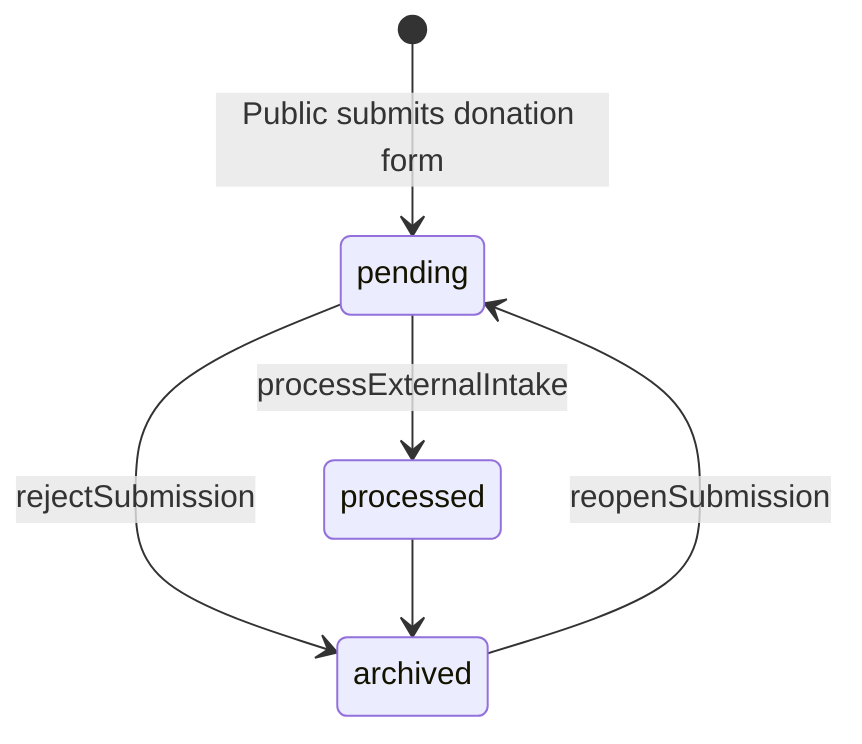
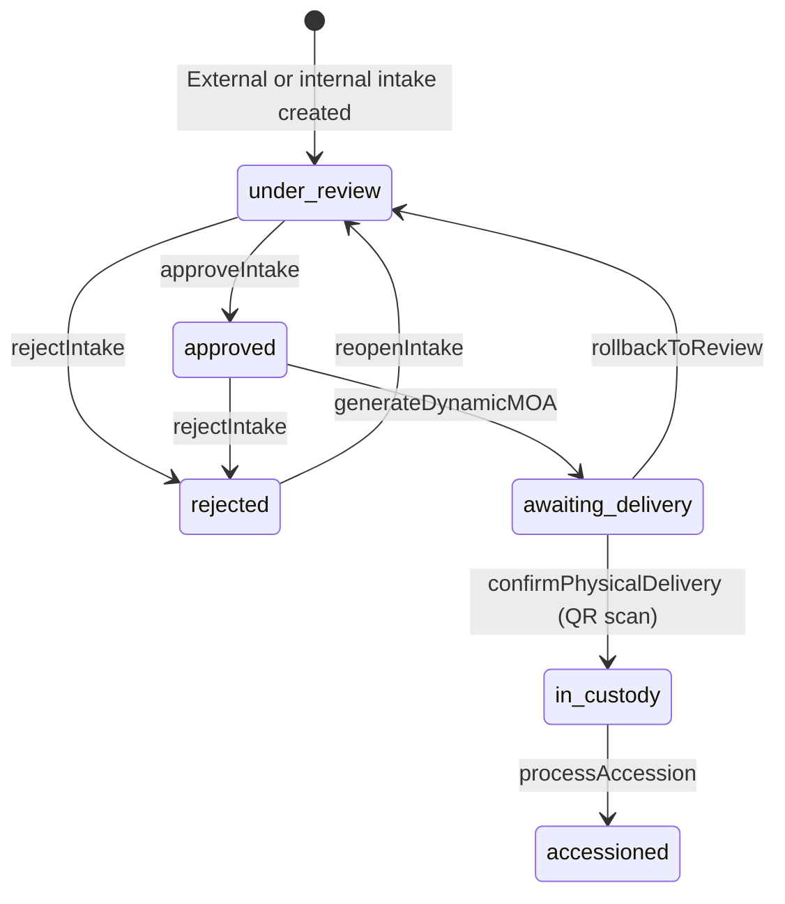
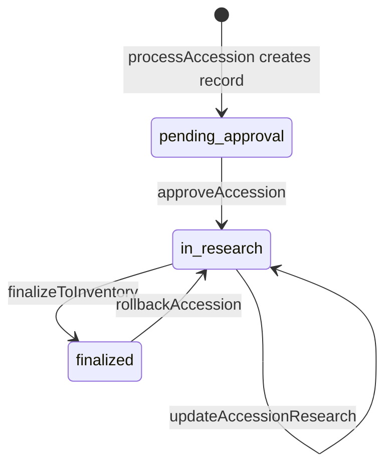
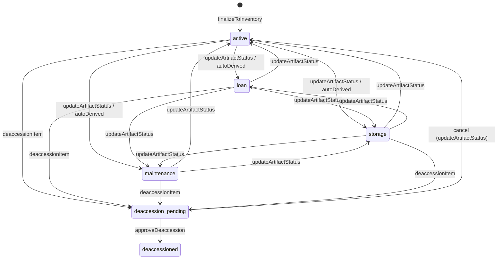

# 🏛️ Museo Bulawan — Artifact Lifecycle & API Reference

> **Last Updated:** 2026-05-06 — Post-refactor (Phases 1–6 complete)
>
> **Standard:** Aligned with [SPECTRUM 5.0](https://collectionstrust.org.uk/spectrum/) (Collections Trust)

---

## 1. Architecture Overview



---

## 2. State Machines

### Submission States


### Intake States (Object Entry)


### Accession States (Formal Registration)


### Inventory States (Collection Management)


---

## 3. Lifecycle Stages — Step by Step

### Stage 1: Form Submission (Public Entry Point)

| Aspect | Detail |
|---|---|
| **Trigger** | Public donor submits donation form via `/api/v1/forms/:slug/submit` |
| **Validation** | OTP verification + AJV schema validation |
| **Storage** | `form_submissions` table (MariaDB) |
| **Initial Status** | `pending` |
| **Security** | Rate-limited, OTP-gated, no authentication required |
| **Audit** | Not audited (anonymous action) |

### Stage 2: Intake Registration (Object Entry per SPECTRUM)

Two entry points:

| Path | Trigger | Method |
|---|---|---|
| **External** | Staff processes a pending submission | `POST /intakes/external/:submissionId` |
| **Internal** | Staff manually enters a walk-in donation or purchase | `POST /intakes/internal` |

**What happens on External Intake:**
1. Donor account auto-provisioned (email → `users` table with `donor` role)
2. Welcome email sent with portal credentials (or update email for returning donors)
3. Submission's `data` JSON is parsed via `field_mapping` from form settings
4. Multi-item support: each item in the submission becomes its own `donation_items` + `intakes` record
5. Submission status → `processed`
6. Each intake status → `under_review`
7. Notification sent to admin role

**What happens on Internal Intake:**
1. Staff provides `itemName`, `sourceInfo`, `method` (gift/loan/purchase/existing), optional `loanEndDate`
2. Single intake record created with status `under_review`

### Stage 3: Review & MOA Generation

| Step | Endpoint | Status Change | Guards |
|---|---|---|---|
| Approve intake | `POST /intakes/:id/approve` | `under_review → approved` | `assertTransition` |
| Reject intake | `POST /intakes/:id/reject` | `under_review → rejected` | `assertTransition` + reason required |
| Generate MOA | `POST /intakes/:id/generate-moa` | `approved → awaiting_delivery` | `assertTransition` |
| Rollback | `POST /intakes/:id/rollback` | `awaiting_delivery → under_review` | `assertTransition` |
| Reopen rejected | `POST /intakes/:id/reopen` | `rejected → under_review` | `assertTransition` |

**MOA Generation produces:**
- HTML preview for in-browser display
- DOCX file (Base64-encoded) for download
- QR delivery token for physical handoff verification
- Contract type auto-derived via `getContractType()`:
  - `gift` → `deed_of_gift`
  - `loan` → `loan_agreement`
  - `purchase` → `bill_of_sale`
  - `existing` → `internal_memo`

### Stage 4: Physical Delivery Confirmation

| Step | Endpoint | Status Change | Guards |
|---|---|---|---|
| Verify token | `GET /delivery/verify/:token` | None (read-only) | Token validity check |
| Confirm delivery | `POST /intakes/:id/confirm-delivery` | `awaiting_delivery → in_custody` | `assertTransition` + QR token validation |

### Stage 5: Formal Accessioning (Acquisition Decision per SPECTRUM)

| Step | Endpoint | Status Change | Guards |
|---|---|---|---|
| Create accession | `POST /accessions/from-intake/:intakeId` | intake: `in_custody → accessioned`, accession: `pending_approval` | `assertTransition` + duplicate check |
| Upload signed MOA | `POST /accessions/:id/upload-moa` | None (data update) | File required |
| Approve accession | `POST /accessions/:id/approve` | `pending_approval → in_research` | `assertTransition` |
| Rollback to research | `POST /accessions/:id/rollback` | `finalized → in_research` | `assertTransition` |

**Accession record automatically derives:**
- `accession_number`: Auto-generated `YYYY.NNN.BB` format (e.g. `2026.001.01`) via atomic MariaDB sequence
- `contract_type`: From `CONTRACT_TYPE_MAP`
- `legal_status`: `"Temporary Custody"` for loans, `"Museum Property"` for everything else

### Stage 6: Curatorial Research Phase

| Step | Endpoint | Status Change | Guards |
|---|---|---|---|
| Update research | `PATCH /accessions/:id/research` | None (data update, status unchanged) | Mutex `accession_{id}` |

Research fields populated incrementally:
- `dimensions`, `materials`, `research_notes`, `historical_significance`
- `tags`, `research_completed` (boolean gate for finalization)
- `research_data` (flexible JSON for additional structured data)

### Stage 7: Inventory Finalization (Cataloging per SPECTRUM)

| Step | Endpoint | Status Change | Guards |
|---|---|---|---|
| Finalize | `POST /inventory/from-accession/:accessionId` | accession: `in_research → finalized`, inventory: created as `active` | **5 mandatory gates** (see below) |

**Finalization Gates (all must pass):**
1. ✅ `dimensions` — Physical measurements recorded
2. ✅ `materials` — Composition/medium recorded
3. ✅ `historical_significance` — Cultural context documented
4. ✅ `signed_moa` — Signed MOA document uploaded
5. ✅ `research_completed` — Curatorial research marked complete
6. ✅ Images uploaded OR `imageSkipReason` provided

**On successful finalization:**
- `catalog_number` auto-generated: `CAT-YYYY-NNNNN` format (e.g. `CAT-2026-00042`)
- Latest condition report copied from accession to inventory
- Initial location history entry created
- Global notification broadcast

### Stage 8: Active Collection Management

| Action | Endpoint | Effect |
|---|---|---|
| Transfer location | `POST /inventory/:id/transfer` | Updates `current_location`, creates `location_history` entry, auto-derives status |
| Batch transfer | `POST /inventory/batch-transfer` | Moves multiple artifacts to same location atomically |
| Update status | `PATCH /inventory/:id/status` | Manual status override (requires justification ≥5 chars) |
| Add condition report | `POST /:entityType/:entityId/condition-reports` | Records artifact condition state |
| Add conservation log | `POST /inventory/:id/conservation` | Records treatment, findings, recommendations |
| Propose deaccession | `POST /inventory/:id/deaccession` | `active → deaccession_pending` (requires reason) |
| Approve deaccession | Via `approveDeaccession` | `deaccession_pending → deaccessioned` (terminal) |

---

## 4. API Filter Reference

All list endpoints now support structured query parameters that are translated into safe, parameterized SQL:

### `GET /api/v1/acquisitions/intakes`

| Parameter | Type | Example | Description |
|---|---|---|---|
| `status` | string | `?status=under_review` | Filter by intake status |
| `method` | string | `?method=gift` | Filter by acquisition method |
| `search` | string | `?search=pottery` | Search `proposed_item_name` (LIKE) |
| `page` | number | `?page=2` | Page number (default: 1) |
| `perPage` | number | `?perPage=25` | Items per page (default: 50) |
| `expand` | string | `?expand=donor_account_id` | Expand FK relations |

### `GET /api/v1/acquisitions/accessions`

| Parameter | Type | Example | Description |
|---|---|---|---|
| `status` | string | `?status=in_research` | Filter by accession status |
| `contractType` | string | `?contractType=deed_of_gift` | Filter by contract type |
| `legalStatus` | string | `?legalStatus=Museum Property` | Filter by legal status |
| `search` | string | `?search=2026.001` | Search `accession_number` (LIKE) |
| `page` | number | `?page=1` | Page number |
| `perPage` | number | `?perPage=25` | Items per page |
| `expand` | string | `?expand=intake_id` | Expand FK relations (default: `intake_id`) |

### `GET /api/v1/acquisitions/inventory`

| Parameter | Type | Example | Description |
|---|---|---|---|
| `status` | string | `?status=active` | Filter by artifact status |
| `location` | string | `?location=Gallery A` | Filter by current location |
| `search` | string | `?search=CAT-2026` | Search `catalog_number` (LIKE) |
| `page` | number | `?page=1` | Page number |
| `perPage` | number | `?perPage=25` | Items per page |
| `expand` | string | `?expand=accession_id.intake_id` | Expand FK chain (default) |

> [!NOTE]
> Deaccessioned items are **excluded** from the main inventory listing. Use `GET /inventory/archive` for the deaccession archive (same filter params minus `status`).

### Common Response Format

```json
{
  "status": "success",
  "data": {
    "page": 1,
    "perPage": 50,
    "totalItems": 142,
    "totalPages": 3,
    "items": [ ... ]
  }
}
```

---

## 5. Data Flow & Traceability

```
form_submissions.data (raw JSON blob)
    ↓ field_mapping via form_definitions.settings
    ↓ Dynamic extraction: itemName, donorName, donorEmail, method
    ↓
donation_items (per-item decomposition)
    ↓ 1:1 with intake
    ↓
intakes (structured record)
    ├── proposed_item_name
    ├── donor_info / donor_account_id (auto-provisioned)
    ├── acquisition_method (gift | loan | purchase | existing)
    ├── submission_id (back-reference)
    └── donation_item_id (back-reference)
    ↓
accessions (formal record)
    ├── accession_number (auto: YYYY.NNN.BB)
    ├── contract_type (auto-derived from method)
    ├── legal_status (auto-derived from method)
    ├── dimensions, materials, research_notes, historical_significance
    ├── signed_moa (uploaded document)
    └── intake_id (back-reference)
    ↓
inventory (catalog record)
    ├── catalog_number (auto: CAT-YYYY-NNNNN)
    ├── current_location
    ├── status (active | loan | maintenance | storage | deaccession_pending | deaccessioned)
    └── accession_id (back-reference)
```

**Full traceability chain:**
```
inventory.accession_id → accessions.intake_id → intakes.submission_id → form_submissions.id
```

---

## 6. Security Matrix

### RBAC Per Stage

| Stage | Required Permission | Roles with Access |
|---|---|---|
| View submissions | `read Intake` | admin, registrar, inventory_staff |
| Process external intake | `create Intake` | admin, registrar |
| Create internal intake | `create Intake` | admin, registrar |
| Approve/Reject/Reopen intake | `update Intake` | admin, registrar |
| Generate MOA | `update Intake` | admin, registrar |
| Confirm delivery | Any authenticated | admin, registrar |
| Process accession | `create Accession` | admin, registrar |
| Upload signed MOA | `update Accession` | admin, registrar |
| Approve accession | `update Accession` | admin, registrar |
| Update research | `update Accession` | admin, registrar |
| Finalize inventory | `create Inventory` | admin, inventory_staff |
| Transfer location | `update Inventory` | admin, inventory_staff |
| Deaccession | `delete Inventory` | admin |
| Update status | `update Inventory` | admin, inventory_staff |

### Concurrency Protection

| Operation | Mutex Key | Transaction | Audit |
|---|---|---|---|
| Process external intake | `sub_{submissionId}` | ❌ | ✅ |
| Create internal intake | — | ❌ | ✅ |
| Approve/Reject intake | `intake_{id}` | ❌ | ✅ |
| Generate MOA | `intake_{id}` | ❌ | ✅ |
| Confirm delivery | `intake_{id}` | ❌ | ✅ |
| Process accession | `intake_{id}` | ❌ | ✅ |
| Approve accession | `accession_{id}` | ❌ | ✅ |
| Update research | `accession_{id}` | ❌ | ✅ |
| Finalize inventory | `accession_{id}` | ❌ | ✅ |
| Transfer location | `inventory_{id}` | ✅ | ✅ |
| Batch transfer | `batch_transfer` | ✅ | ✅ |
| Deaccession | `inventory_{id}` | ❌ | ✅ |
| Conservation log | `conservation_{id}` | ❌ | ✅ |
| Sequence generation | MariaDB `LAST_INSERT_ID()` | Atomic | — |

### SQL Injection Prevention

All filter queries go through `baseService._buildFilterClause()` which:
- Parses PB-style filter syntax (`field="value" && field!="value"`)
- Outputs parameterized SQL with `?` placeholders
- Ignores unparseable segments (logged as warnings)
- Validates table names against `ALLOWED_TABLES` whitelist

---

## 7. Auto-Number Formats

| Number | Format | Example | Source |
|---|---|---|---|
| Accession Number | `YYYY.NNN.BB` | `2026.001.01` | `sequenceGenerator.generateAccessionNumber()` |
| Catalog Number | `CAT-YYYY-NNNNN` | `CAT-2026-00042` | `sequenceGenerator.generateCatalogNumber()` |

Both use MariaDB's `LAST_INSERT_ID()` for atomic, race-condition-free incrementing with automatic year-boundary resets.
