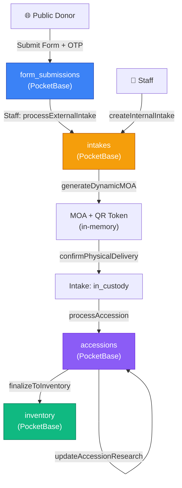
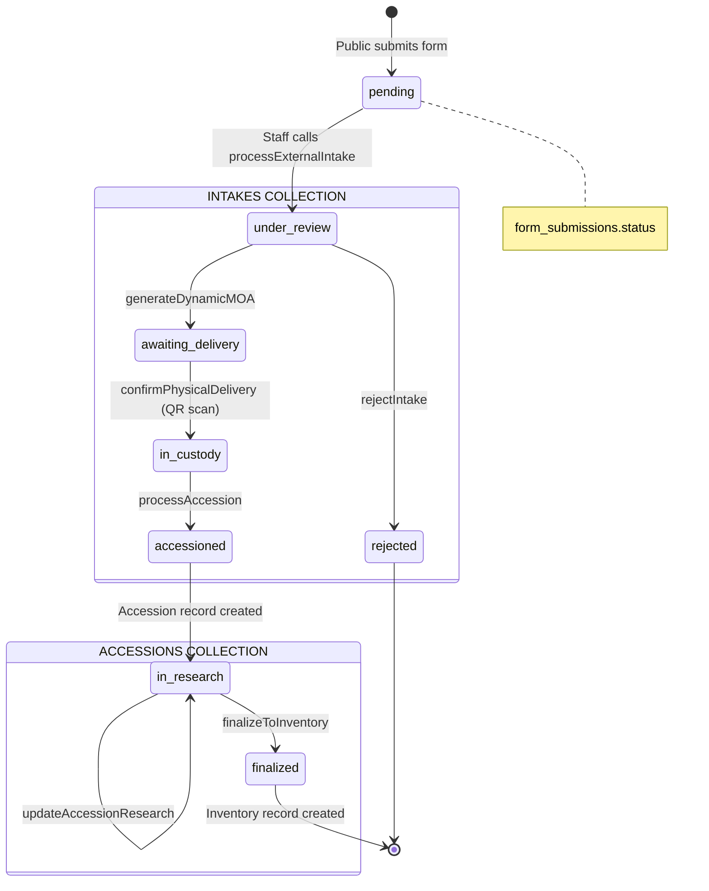

# 📋 Donation Form Lifecycle & Inventory Integration Evaluation

## System Architecture Overview



---

## 1. Form Submission Visibility

### How Submissions Are Stored
- **Storage:** PocketBase `form_submissions` collection
- **Fields:** `form_id` (relation → `form_definitions`), `data` (JSON blob), `status` (pending/processed/archived), `attachments` (files), `created`/`updated` (auto)
- **Entry Points:**
  - `POST /api/v1/forms/:slug/submit` — public route with OTP verification and Ajv schema validation
  - `POST /api/v1/upload/donation` — file-based donation submissions (consolidated into `form_submissions`)

### How Staff Can View Submissions
- **API Endpoint:** `GET /api/v1/forms/:slug/submissions` 
  - Protected by `requireAuth → buildAbility → checkPermission('read', 'Intake')`
  - Supports pagination (`page`, `perPage`) and sort (`sort`)
  - Filters by `form_id` automatically via the slug lookup

### Current Gaps

| Feature | Status | Notes |
|---|---|---|
| List submissions by slug | ✅ Implemented | [formRoutes.js:38](file:///c:/Users/jeffe/Development/prod-dev/museo-bulawan-cms/apps/api/src/routes/formRoutes.js#L38) |
| Filter by status | ❌ **Missing** | No `status` filter on the query. Staff cannot filter pending vs. processed |
| Search by donor name/email | ❌ **Missing** | No text search on `data` JSON blob |
| View single submission detail | ❌ **Missing** | No `GET /forms/:slug/submissions/:id` endpoint |
| Admin Panel: Submissions Page | ❌ **Missing** | No `Submissions.jsx` page exists. Staff have no UI to see incoming submissions |
| Timestamps | ✅ Auto | PocketBase `created`/`updated` autodates |
| Submitter traceability | ⚠️ Partial | Donor email is inside the `data` JSON blob, not a first-class field |
| Attachment visibility | ⚠️ Partial | Files exist in PB but require the file proxy to access (`/api/v1/file/:collection/:recordId/:filename`) |

> [!WARNING]
> **Critical Frontend Gap:** There is no `Submissions.jsx` page in the admin panel. Staff currently have **no way to see incoming donation forms** unless they go directly to the PocketBase admin UI. This is the single biggest operational gap.

---

## 2. Intake and Processing Pipeline

### Workflow Map



### Stage-by-Stage Analysis

| Stage | Trigger | Status Change | Guard | Mutex | Audit |
|---|---|---|---|---|---|
| **Form → Intake** | `processExternalIntake(submissionId)` | submission: `pending→processed`, intake: `under_review` | `status !== 'pending'` | ✅ `sub_{id}` | ✅ |
| **Internal Intake** | `createInternalIntake(...)` | intake: `under_review` | None | ❌ | ✅ |
| **Reject Intake** | `rejectIntake(intakeId, reason)` | intake: `under_review→rejected` | `status !== 'under_review'` | ✅ `intake_{id}` | ✅ |
| **Generate MOA** | `generateDynamicMOA(intakeId)` | intake: `under_review→awaiting_delivery` | `!['under_review','approved']` | ✅ `intake_{id}` | ✅ |
| **Confirm Delivery** | `confirmPhysicalDelivery(intakeId, token)` | intake: `awaiting_delivery→in_custody` | `status !== 'awaiting_delivery'` + QR token validation | ✅ `intake_{id}` | ✅ |
| **Process Accession** | `processAccession(intakeId, data)` | intake: `in_custody→accessioned`, accession: `in_research` | `status !== 'in_custody'` | ✅ `intake_{id}` | ✅ |
| **Update Research** | `updateAccessionResearch(accessionId, data)` | accession: unchanged | None | ❌ | ✅ |
| **Finalize Inventory** | `finalizeToInventory(accessionId, data)` | accession: `→finalized`, inventory record created | `status === 'finalized'` prevents double-finalize + 4 required fields check | ✅ `accession_{id}` | ✅ |

### Invalid Transition Prevention

| Transition | Enforcement | Rating |
|---|---|---|
| Skip from `pending` to `in_custody` | ✅ Each stage checks current status | Strong |
| Re-process already processed submission | ✅ `status !== 'pending'` guard | Strong |
| Re-reject already rejected intake | ✅ `status !== 'under_review'` guard | Strong |
| Double-finalize accession | ✅ `status === 'finalized'` guard | Strong |
| Skip from `under_review` to `accessioned` | ✅ `processAccession` requires `in_custody` | Strong |
| Re-open rejected intake | ❌ **No endpoint** | Gap |
| Rollback from `awaiting_delivery` back to `under_review` | ❌ **No endpoint** | Gap |

### RBAC Per Stage

| Stage | Required Permission | Roles with Access |
|---|---|---|
| View submissions | `read Intake` | admin, registrar, inventory_staff |
| Process external intake | `manage Intake` | admin, registrar |
| Create internal intake | `manage Intake` | admin, registrar |
| Reject intake | `manage Intake` | admin, registrar |
| Generate MOA | `manage Intake` | admin, registrar |
| Confirm delivery | `manage Intake` | admin, registrar |
| Process accession | `manage Accession` | admin, registrar |
| Update research | `manage Accession` | admin, registrar |
| Finalize inventory | `manage Inventory` | admin, inventory_staff |

> [!NOTE]
> The role hierarchy is well-structured. Admin inherits all permissions. The registrar handles the intake-to-accession pipeline, and inventory_staff handles the final cataloging step.

---

## 3. Data Transformation and Structuring

### Data Flow

```
form_submissions.data (raw JSON blob)
    ↓ field_mapping in form_definitions.settings
    ↓ Dynamic extraction: itemName, firstName, lastName, donorEmail, method
    ↓
intakes (structured record)
    ├── proposed_item_name (extracted from data)
    ├── donor_info (extracted and combined)
    ├── acquisition_method (extracted or defaulted to 'gift')
    ├── donor_account_id (auto-provisioned from email)
    └── submission_id (back-reference to original submission)
    ↓
accessions (formal record)
    ├── accession_number (staff-assigned)
    ├── contract_type (mapped from acquisition_method)
    ├── legal_status (derived from method)
    └── intake_id (back-reference)
    ↓
inventory (catalog record)
    ├── catalog_number (staff-assigned)
    ├── current_location
    ├── condition_report (copied from accession)
    └── accession_id (back-reference)
```

### Assessment

| Concern | Status | Details |
|---|---|---|
| Raw vs. processed distinction | ✅ Clear | `form_submissions` holds raw data, `intakes` holds structured data |
| Back-references maintained | ✅ Full chain | `inventory → accession_id → intake_id → submission_id` |
| Data duplication | ⚠️ Minor | `condition_report` is copied from accession to inventory |
| Data mutation risk | ✅ Low | Original submission data is never modified (only status changes) |
| Item-level granularity | ❌ **Missing** | One submission = one intake. No support for multiple items per donation |

> [!IMPORTANT]
> **Item-Level Granularity Gap:** A donor submitting "3 clay pots and 2 textiles" creates a single intake record with `proposed_item_name = "clay pots"` (extracted from the first mapped field). The system has no way to split a multi-item donation into individual tracked items.

---

## 4. Accessioning / Formal Acceptance

### ✅ Present and Well-Structured

The accessioning step is implemented and enforces:

1. **Pre-condition:** Intake must be `in_custody` (physical delivery confirmed)
2. **Accession number:** Staff-assigned, unique (enforced by PB unique index on `accession_number`)
3. **Contract type mapping:** Auto-derived from `acquisition_method`:
   - `gift` → `deed_of_gift`
   - `loan` → `loan_agreement`
   - `purchase` → `bill_of_sale`
   - `existing` → `internal_memo`
4. **Legal status:** Auto-derived:
   - Loans → "Temporary Custody"
   - Everything else → "Museum Property"
5. **MOA tracking:** `isMoaSigned` flag updates `moa_status` on the intake
6. **Research phase:** After accessioning, status is `in_research`, allowing incremental updates to `dimensions`, `materials`, `research_notes`, `historical_significance`

### Accession Gaps

| Feature | Status |
|---|---|
| Accession number auto-generation | ❌ Manual entry only |
| Signed MOA file upload | ⚠️ Field exists (`signed_moa`) but no upload endpoint connects to it |
| Accession approval workflow | ❌ Single-step (no multi-approver) |
| Accession deletion/reversal | ❌ No endpoint |

---

## 5. Inventory Integration

### Trigger: Manual via API

```
POST /api/v1/acquisitions/accession/:accessionId/finalize
```

### Required Fields Before Insertion

The system enforces **4 mandatory research fields** before allowing finalization:

1. `dimensions` — Physical measurements
2. `materials` — Composition/medium
3. `initial_condition_report` — Current state of the artifact
4. `historical_significance` — Why it matters

If any are missing, the API returns a `400` with a clear error listing the missing fields.

### Inventory Record Structure

| Field | Source | Unique |
|---|---|---|
| `catalog_number` | Staff-assigned | ✅ Unique index |
| `current_location` | Staff-assigned (default: "Receiving Bay") | No |
| `condition_report` | Copied from accession | No |
| `accession_id` | Relation to accession | No |
| `version` | Auto (starts at 1) | No |
| `created_by` / `updated_by` | Auto (PB app_user relation) | No |

### Linkage Chain

```
inventory.accession_id → accessions.intake_id → intakes.submission_id → form_submissions.id
```

✅ **Full traceability** from final catalog item back to the original public form submission.

### Inventory Gaps

| Feature | Status |
|---|---|
| Location transfer tracking | ❌ No move history |
| Condition report updates | ❌ No dedicated endpoint |
| Deaccession workflow | ❌ No removal/disposal process |
| Photo/media attachment | ❌ No image field on inventory |
| Catalog number auto-generation | ❌ Manual entry only |

---

## 6. Auditability and Traceability

### Audit Coverage

Every mutation in the pipeline goes through `_createRecord` or `_updateRecord`, which call `auditService.log()`:

```js
await auditService.log({
    collection,      // Which PB collection
    recordId,        // Which record
    action,          // 'create' or 'update'
    userId,          // MariaDB user ID → mapped to PB app_user
    before,          // Snapshot before change (null for creates)
    after            // Snapshot after change
});
```

### Coverage Matrix

| Action | Audit Logged | Before/After Diff | Who |
|---|---|---|---|
| Create intake (external) | ✅ | ✅ null → record | ✅ staff ID |
| Create intake (internal) | ✅ | ✅ null → record | ✅ staff ID |
| Reject intake | ✅ | ✅ full diff | ✅ staff ID |
| Generate MOA | ✅ | ✅ full diff | ✅ staff ID |
| Confirm delivery | ✅ | ✅ full diff | ✅ staff ID |
| Process accession | ✅ | ✅ full diff (x2: accession + intake update) | ✅ staff ID |
| Update research | ✅ | ✅ full diff | ✅ staff ID |
| Finalize inventory | ✅ | ✅ full diff (x2: inventory + accession update) | ✅ staff ID |
| Form submission | ❌ | N/A | Donor (anonymous) |
| Login/Logout | ✅ | Via `auditService.log` in authController | ✅ user ID |

### Audit Gaps

| Concern | Status |
|---|---|
| Submission event not audited | ⚠️ Anonymous action, no PB app_user to link |
| Audit log viewer in admin panel | ❌ No `AuditLogs.jsx` page exists |
| Audit log export | ❌ No CSV/JSON export endpoint |
| Audit log retention policy | ❌ No cleanup/archival mechanism |

---

## 7. Operational Gaps and Risks

### Critical Gaps

| # | Gap | Severity | Impact |
|---|---|---|---|
| 1 | **No Submissions Page in Admin Panel** | 🔴 Critical | Staff cannot see incoming donations without using PB admin |
| 2 | **No multi-item support** | 🔴 Critical | A donation of 5 items becomes 1 record |
| 3 | **OTP stored in memory** | 🟡 High | OTP cache lost on server restart; won't work in multi-instance deployment |
| 4 | **No rollback/reopen endpoints** | 🟡 High | Once rejected, an intake is permanently dead |
| 5 | **Signed MOA upload disconnected** | 🟡 Medium | `signed_moa` field exists on accessions but nothing writes to it |
| 6 | **Research update has no mutex** | 🟡 Medium | Two staff updating research simultaneously could overwrite each other |
| 7 | **No status filter on submission listing** | 🟢 Low | Staff must scan all submissions to find pending ones |
| 8 | **No accession number auto-generation** | 🟢 Low | Relies on staff entering unique numbers manually |

### State Machine Weakness

The current system uses **per-method `if` checks** rather than a centralized state machine. This means:
- Valid transitions are scattered across 6+ methods
- Adding a new state requires modifying multiple functions
- No single source of truth for "what transitions are legal"

### Race Condition Analysis

| Operation | Protection | Risk |
|---|---|---|
| Process external intake | ✅ `globalMutex.runExclusive('sub_${id}')` | Safe |
| Reject intake | ✅ `globalMutex.runExclusive('intake_${id}')` | Safe |
| Generate MOA | ✅ `globalMutex.runExclusive('intake_${id}')` | Safe |
| Confirm delivery | ✅ `globalMutex.runExclusive('intake_${id}')` | Safe |
| Process accession | ✅ `globalMutex.runExclusive('intake_${id}')` | Safe |
| Finalize inventory | ✅ `globalMutex.runExclusive('accession_${id}')` | Safe |
| Update research | ❌ **No mutex** | ⚠️ Last-write-wins |
| Create internal intake | ❌ **No mutex** | Low risk (no shared state) |

---

## 8. Recommendations for Improvement

### Priority 1: Immediate (Blocks Basic Operations)

#### A. Create Submissions Management Page
The admin panel needs a `Submissions.jsx` page that:
- Lists all `form_submissions` with status filters (pending, processed, archived)
- Shows submission detail with the raw `data` JSON rendered as a readable form
- Has a "Process → Intake" button that calls `processExternalIntake`
- Displays attached files

#### B. Add Status Filter to Submission API
```js
// In formService.listSubmissions
if (query.status) options.filter += ` && status="${query.status}"`;
```

#### C. Create Audit Log Viewer Page
`AuditLogs.jsx` connected to `GET /api/v1/audit-logs`

### Priority 2: Operational Alignment

#### D. Multi-Item Donation Support
Introduce an intermediate `donation_items` concept:
```
form_submission (1) → donation_items (N) → intakes (N)
```
This would require a new PB collection and a modified `processExternalIntake` that iterates over an items array in the submission data.

#### E. State Machine Formalization
```js
const INTAKE_TRANSITIONS = {
    'under_review': ['awaiting_delivery', 'rejected'],
    'awaiting_delivery': ['in_custody'],
    'in_custody': ['accessioned'],
    'rejected': ['under_review'], // Allow re-open
    'accessioned': [] // Terminal
};

function assertTransition(current, target) {
    if (!INTAKE_TRANSITIONS[current]?.includes(target)) {
        throw new Error(`Invalid transition: ${current} → ${target}`);
    }
}
```

#### F. Add Mutex to Research Updates
```js
async updateAccessionResearch(staffId, accessionId, researchData) {
    return await globalMutex.runExclusive(`accession_${accessionId}`, async () => {
        return await this._updateRecord(staffId, 'accessions', accessionId, researchData);
    });
}
```

### Priority 3: Production Hardening

#### G. Move OTP Cache to Redis
Replace `new Map()` with Redis to survive restarts and work across multiple server instances.

#### H. Accession Number Auto-Generation
```
Format: YYYY-NNNN (e.g., 2026-0042)
```
Use a MariaDB counter sequence or a PB auto-increment pattern.

#### I. Signed MOA Upload Endpoint
Create a route that accepts a file upload and writes it to the `signed_moa` field on the accession record.

#### J. Rollback / Re-open Endpoints
- `POST /:intakeId/reopen` — moves rejected intake back to `under_review`
- `POST /:intakeId/return` — marks an awaiting_delivery intake as `returned`

---

## 9. Expected Outcome Summary

### Current Lifecycle (As Implemented)

```
✅ Public form submission with OTP verification and schema validation
✅ Staff-triggered intake creation from submissions (external and internal)
✅ MOA generation with contract type mapping and QR-based delivery confirmation
✅ Formal accessioning with legal status, condition reports, and contract tracking
✅ Research phase with incremental updates and 4-field completion gate
✅ Inventory finalization with unique catalog numbers and full back-references
✅ Audit trail on every mutation with before/after snapshots
✅ RBAC enforcement at every stage via CASL
✅ Race condition protection via AsyncMutex on all critical state transitions
✅ Real-time updates via SSE bridging from PocketBase subscriptions
```

### Deviations from Standard Museum Practices

| Standard Practice | Current Implementation | Gap |
|---|---|---|
| Multi-item donation tracking | Single-item per intake | No item decomposition |
| Submission review queue | Direct API call to process | No dedicated review UI |
| Accession register with auto-numbering | Manual accession number entry | No sequence generator |
| Signed contract storage | Field exists, not connected | No upload flow |
| Deaccession process | Not implemented | No removal workflow |
| Location transfer log | Not implemented | No move history |
| Conservation records | CASL role exists but no collection | No `conservation_logs` collection |

### Overall Rating

| Dimension | Score | Notes |
|---|---|---|
| **Data Integrity** | ⭐⭐⭐⭐ | Full referential chain, versioning, soft deletes |
| **Workflow Enforcement** | ⭐⭐⭐⭐ | Strong guards, mutex protection, but no formal state machine |
| **Auditability** | ⭐⭐⭐⭐⭐ | Before/after diffs on every mutation, linked to staff |
| **Frontend Coverage** | ⭐⭐ | Intakes, Accessions, Inventory pages exist but Submissions & Audit pages missing |
| **Scalability** | ⭐⭐⭐ | In-memory OTP and mutex won't work in clustered deployment |
| **Operational Completeness** | ⭐⭐⭐ | Core happy path is solid, but rollback/reopen/deaccession gaps |
